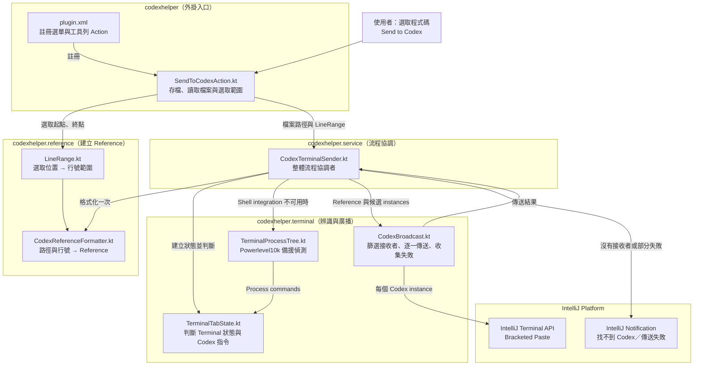

# 原始碼關聯圖

這張圖呈現一次 **Send to Codex** 操作從 IntelliJ Action 入口、Reference 建立、Codex instance 辨識，到最後廣播傳送的主要關聯。

閱讀時可以從 `plugin.xml` 和根 package 的 `SendToCodexAction.kt` 開始，接著沿著實線箭頭追到 `service/CodexTerminalSender.kt`；Reference 的建立集中在 `reference` package，Terminal 狀態、Codex 指令辨識與廣播則集中在 `terminal` package。
